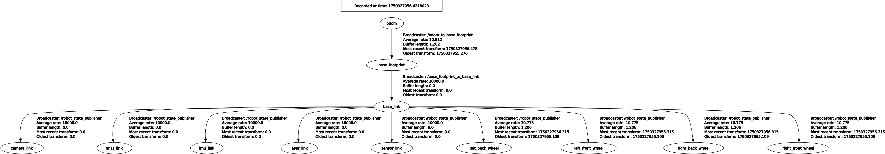
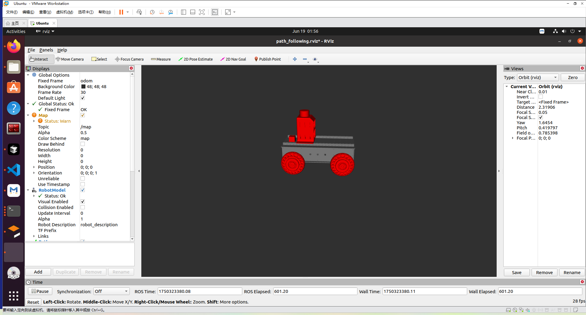
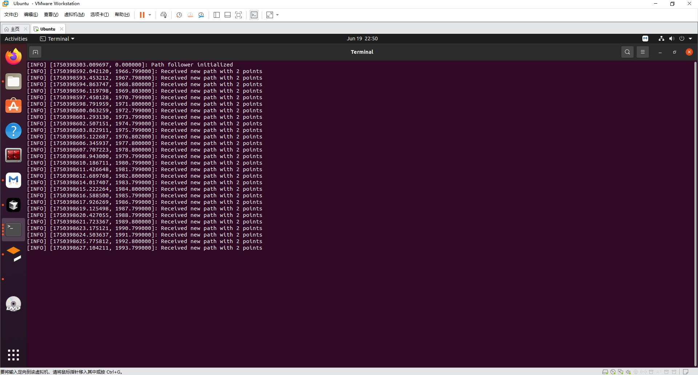
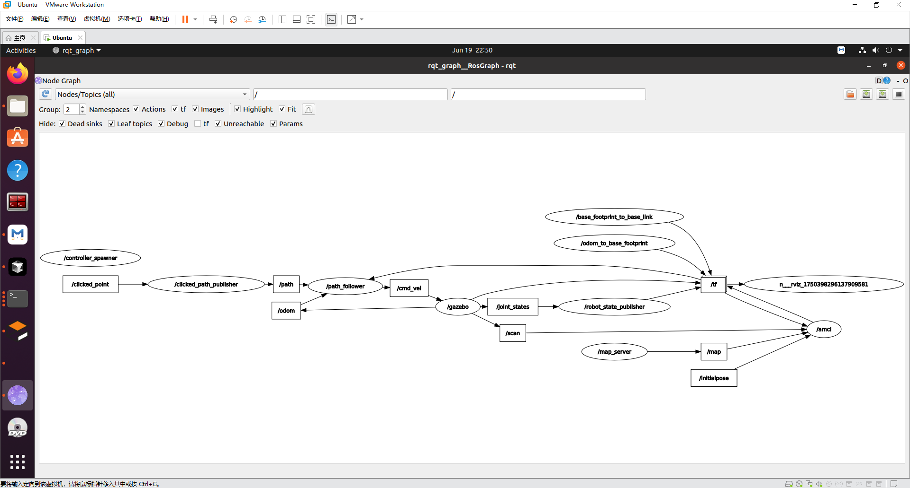

# 基于Gazebo仿真环境的智能车辆导航控制

本项目是一个基于 ROS (Robot Operating System) 和 Gazebo 的高保真仿真平台，专为学习、测试和验证经典的自动驾驶路径跟踪控制算法而设计。平台集成了一个四轮差速驱动机器人模型、一个带有多样化场景的城市世界，并内置了从基本PID到高级MPC的多种控制算法实现。


---

## 目录

- [功能特性](#功能特性)
- [核心组件与ROS接口](#核心组件与ros接口)
- [已实现的控制算法](#已实现的控制算法)
  - [Pure Pursuit (纯跟踪)](#pure-pursuit-纯跟踪)
  - [PID (比例-积分-微分)](#pid-比例-积分-微分)
  - [Stanley 控制器](#stanley-控制器)
  - [LQR (线性二次调节器)](#lqr-线性二次调节器)
  - [MPC (模型预测控制)](#mpc-模型预测控制)
- [安装与配置](#安装与配置)
- [使用指南](#使用指南)
- [故障排查](#故障排查)

---

## 功能特性

- **高保真仿真**: 使用Gazebo构建了一个包含道路、建筑、交通标志和植被的城市环境，提供逼真的物理和视觉仿真。
- **模块化控制器**: 每种路径跟踪算法都实现为独立的ROS节点，结构清晰，方便单独测试、比较和替换。
- **丰富的算法集**: 内置了五种主流的路径跟踪算法，覆盖了从几何方法到最优化控制的多种技术路线。
- **交互式路径生成**: 支持在RViz中通过鼠标点击动态规划路径，即时下发给机器人执行。
- **标准化的ROS接口**: 所有控制器都遵循统一的输入/输出接口，易于扩展和集成新算法。

---

## 核心组件与ROS接口



### 1. 仿真环境与机器人模型

- **Gazebo世界**: 世界文件位于 `src/my_gazebo_world/worlds/small_city.world`，定义了仿真环境的物理属性和静态模型。
- **机器人模型 (URDF)**: 模型文件位于 `src/mickrobot_gazebo/mickrobot_description/urdf/mickrobot_simple.urdf`，定义了机器人的连杆、关节、传感器和物理属性。

### 2. ROS 节点与话题 (API)


本项目通过标准的ROS话题进行节点间通信，核心数据流如下：

- **`/path`** (`nav_msgs/Path`)
  
  - **发布者**: `clicked_path_publisher.py` (用户在RViz中点击生成)
  - **订阅者**: 所有的控制器节点 (`pid_follower.py`, `stanley_follower.py`, etc.)
  - **作用**: 传输用户期望机器人跟踪的路径点序列。

- **`/odom`** (`nav_msgs/Odometry`)
  
  - **发布者**: Gazebo (通过 `gazebo_ros_p3d`插件)
  - **订阅者**: 所有的控制器节点，以及 `tf`系统。
  - **作用**: 提供机器人的里程计信息，包括实时位置、姿态和速度。

- **`/cmd_vel`** (`geometry_msgs/Twist`)
  
  - **发布者**: 当前激活的控制器节点。
  - **订阅者**: Gazebo (通过 `gazebo_ros_diff_drive`插件)
  - **作用**: 将控制器计算出的线速度和角速度指令发送给机器人执行。

- **`/tf`** (`tf2_msgs/TFMessage`)
  
  - **作用**: 维护 `map` -> `odom` -> `base_link`等一系列坐标系之间的变换关系，是定位和导航的基础。

---

## 已实现的控制算法：原理与解析

### Pure Pursuit (纯跟踪)

- **核心思想**: 模拟人类驾驶行为，即眼睛始终注视着前方某一点，并不断调整方向盘使车辆朝该点行驶。

- **工作原理**:
  
  1. **寻找前瞻点 (Look-Ahead Point)**: 算法在预设的参考路径上，从当前车辆位置向前搜索一个固定距离（`lookahead_dist`）的点，这个点就是"前瞻点"。
  2. **几何关系**: 车辆的控制目标简化为：计算出一个完美的**圆弧**，该圆弧的起点是车辆的后轴中心，并精确地通过前瞻点。
  3. **计算曲率**: 根据几何关系，可以推导出该圆弧的曲率 `κ`。一个简化的关键公式是 `κ = 2 * sin(α) / Ld`，其中 `α` 是车辆当前航向与前瞻点连线之间的夹角，`Ld` 是前瞻距离。
  4. **生成转向指令**: 车辆的转向角 `δ` 与曲率 `κ` 和轴距 `L` 直接相关，即 `δ = atan(κ * L)`。控制器将计算出的目标转向角转换为角速度指令发布。

- **核心代码实现**:
  
  ```python
  # 找到前瞻点
  lookahead_point = find_lookahead_point(self.path_points, robot_pose, self.lookahead_dist)
  
  if lookahead_point:
      lx, ly = lookahead_point
      # 计算目标点在机器人坐标系下的位置
      dx = math.cos(-yaw)*(lx - robot_x) - math.sin(-yaw)*(ly - robot_y)
      dy = math.sin(-yaw)*(lx - robot_x) + math.cos(-yaw)*(ly - robot_y)
  
      # 计算曲率
      curvature = 2 * dy / (self.lookahead_dist**2)
  
      # 生成指令
      linear = self.max_linear
      angular = max(-self.max_angular, min(self.max_angular, linear * curvature))
      cmd.linear.x = linear
      cmd.angular.z = angular
  ```

- **优缺点**:
  
  - **优点**: 算法简单、直观，计算量小，在低速和中速下表现平滑。
  - **缺点**: 跟踪精度严重依赖前瞻距离 `Ld`，`Ld` 太小会导致震荡，太大则会在急弯处"切角"过大，精度下降。

- **关键参数**: `lookahead_dist` (前瞻距离)。

- **运行脚本**: `rosrun mickrobot_gazebo pure_pursuit_follower.py`

---

### PID (比例-积分-微分)

- **核心思想**: 最经典的闭环反馈控制。它不关心车辆的几何或动力学模型，只根据当前的"误差"来调整输出。

- **工作原理**:
  控制器的输出（转向角速度）由三个部分线性叠加而成：
  
  1. **P (Proportional) - 比例项**: `Kp * e(t)`。与当前的**横向误差** `e(t)`（车辆中心到路径的最短距离）成正比。
  2. **I (Integral) - 积分项**: `Ki * ∫e(t)dt`。累加过去所有的历史误差，用于**消除稳态误差**。
  3. **D (Derivative) - 微分项**: `Kd * de(t)/dt`。与误差的变化率成正比，作用是**抑制超调和振荡**。

- **核心代码实现**:
  
  ```python
  # 计算横向误差 (cross-track error)
  cross_track_error = calculate_cte(robot_pose, self.path_points)
  
  # 比例项
  p_term = self.kp * cross_track_error
  
  # 积分项
  self.integral_error += cross_track_error
  i_term = self.ki * self.integral_error
  
  # 微分项
  derivative_error = cross_track_error - self.previous_error
  d_term = self.kd * derivative_error
  self.previous_error = cross_track_error
  
  # 叠加得到角速度
  angular_speed = p_term + i_term + d_term
  ```

- **优缺点**:
  
  - **优点**: 原理简单，易于实现，不依赖精确的模型，在许多简单场景下非常有效。
  - **缺点**: 参数整定（Tuning）非常耗时，且一组PID参数通常只在特定的速度和路况下表现最佳。

- **关键参数**: `kp`, `ki`, `kd` (比例、积分、微分增益)。

- **运行脚本**: `rosrun mickrobot_gazebo pid_follower.py`

---

### Stanley 控制器

- **核心思想**: 一种基于几何的非线性反馈控制器，巧妙地结合了航向对齐和横向误差修正。

- **工作原理**:
  其转向指令 `δ` 由两部分构成：
  
  1. **航向对齐**: `δ_heading = ψ_path - ψ_robot`。
  2. **横向误差修正**: `δ_crosstrack = atan(k * e_fa / v)`。
     最终的控制律是两者之和：`δ = δ_heading + δ_crosstrack`。

- **核心代码实现**:
  
  ```python
  # 横向误差 (前轴到路径的距离)
  cross_track_error = calculate_front_axle_cte(robot_pose, path, self.L)
  
  # 航向误差
  path_angle = get_path_angle(robot_pose, path)
  heading_error = path_angle - yaw
  
  # Stanley 控制律
  # 避免除以零
  if self.current_speed < 0.1:
      delta = heading_error
  else:
      term_cte = math.atan2(self.k * cross_track_error, self.current_speed)
      delta = heading_error + term_cte
  
  angular_speed = delta
  ```

- **优缺点**:
  
  - **优点**: 物理意义清晰，收敛速度快，在各种速度下都表现良好。
  - **缺点**: 仍然是一种几何控制器，未考虑车辆的动力学特性，在极限工况下性能会下降。

- **关键参数**: `k` (横向误差增益)。

- **运行脚本**: `rosrun mickrobot_gazebo stanley_follower.py`

---

### LQR (线性二次调节器)

- **核心思想**: 求解一个**最优控制器**，而不是"设计"一个。它通过最小化一个综合了跟踪误差和控制消耗的代价函数，来获得最优的反馈增益。

- **工作原理**:
  
  1. **状态空间建模**: 将车辆运动描述为线性状态空间方程 `ẋ = Ax + Bu`。
  2. **定义代价函数**: `J = ∫(xᵀQx + uᵀRu)dt`，其中 `Q` 和 `R` 是权重矩阵。
  3. **求解Riccati方程**: 通过求解代数Riccati方程，得到最优反馈增益矩阵 `K`。
  4. **最优控制律**: `u = -Kx`。最优的转向指令是当前状态误差的线性组合。

- **核心代码实现**:
  
  ```python
  # 状态误差 [横向误差, 航向误差]
  x = np.array([[cross_track_error], [heading_error]])
  
  # 线性化的状态空间模型 (自行车模型)
  A = np.array([[1, self.dt * self.current_speed],
                [0, 1]])
  B = np.array([[0],
                [self.dt * self.current_speed / self.L]])
  
  # 求解LQR增益K
  K = self.dlqr(A, B, self.Q, self.R)
  
  # LQR 控制律 u = -Kx
  u = -K @ x
  
  angular_speed = u[0, 0]
  ```

- **优缺点**:
  
  - **优点**: 理论上的最优解，鲁棒性好，通过调整 `Q`和 `R`可以系统地权衡"快速"与"平稳"。
  - **缺点**: 依赖于**线性**系统模型，在远离平衡点时性能可能下降。

- **关键参数**: `Q` (状态权重矩阵), `R` (控制权重矩阵)。

- **运行脚本**: `rosrun mickrobot_gazebo lqr_follower.py`

---

### MPC (模型预测控制)

- **核心思想**: **基于模型的预测**和**滚动优化**，像一个能"预见未来"并反复修正计划的棋手。

- **工作原理**:
  在每一个控制周期，MPC会：
  
  1. **预测 (Prediction)**: 基于车辆模型，预测未来 `N` 个时间步的轨迹。
  2. **优化 (Optimization)**: 在预测时域内，求解一个有约束的最优控制问题，找到能最小化代价函数的最优控制序列 `[u₀*, u₁*, ...]`。
  3. **执行 (Execution)**: 只将序列中的**第一个**最优控制输入 `u₀*` 应用到车辆。然后抛弃旧计划，在下个周期重新循环。

- **核心代码实现**:
  
  ```python
  # 创建优化问题
  opti = Opti()
  
  # 状态变量 [x, y, yaw] over N+1 steps
  X = opti.variable(3, current_N + 1)
  # 控制变量 [v, w] over N steps
  U = opti.variable(2, current_N)
  
  # 初始状态约束
  opti.subject_to(X[:, 0] == current_state)
  
  # 动态约束 (车辆模型)
  for k in range(current_N):
      opti.subject_to(X[:, k+1] == vehicle_model(X[:, k], U[:, k], self.dt))
  
  # 成本函数 (跟踪误差 + 控制消耗)
  objective = 0
  for k in range(current_N):
      objective += calculate_cost(X[:, k], U[:, k], ref_path[k], self.Q, self.R)
  opti.minimize(objective)
  
  # 输入约束
  opti.subject_to(opti.bounded(min_v, U[0, :], max_v))
  opti.subject_to(opti.bounded(min_w, U[1, :], max_w))
  
  # 求解
  sol = opti.solve()
  # 只取第一个控制指令
  cmd.linear.x = sol.value(U[0, 0])
  cmd.angular.z = sol.value(U[1, 0])
  ```

- **优缺点**:
  
  - **优点**: 能处理约束、具有前瞻性、鲁棒性强。
  - **缺点**: **计算量巨大**，对硬件要求高。

- **关键参数**: `N` (预测时域), `Q`和 `R` (权重矩阵)。

- **运行脚本**: `rosrun mickrobot_gazebo mpc_follower.py`

---

## 安装与配置

1. **ROS环境**: 本项目在 **ROS Noetic**下开发和测试。请确保ROS环境已正确安装。

2. **Catkin工作空间**:
   将本项目克隆到你的Catkin工作空间的 `src`目录下，然后返回工作空间根目录进行编译：
   
   ```bash
   cd ~/catkin_ws/
   catkin_make
   source devel/setup.bash
   ```

3. **Python 依赖**:
   请确保已安装 `pip`。LQR和MPC控制器需要额外的数值计算库：
   
   ```bash
   # LQR 控制器依赖
   pip install scipy
   
   # MPC 控制器依赖
   pip install casadi
   ```

---

## 使用指南

### 方法一: 一键启动 (推荐)

项目提供了一个便捷的启动脚本，可以一次性启动所有必要的组件。

```bash
# 确保脚本有可执行权限
chmod +x run_all.sh
# 运行
./run_all.sh
```

**注意**: `run_all.sh`默认启动的是 `path_follower.py`。你可以通过编辑此脚本的最后一行来更换为你希望运行的控制器。

### 方法二: 手动分步启动

如果你希望对每个组件进行精细控制或调试，可以手动启动：

1. **启动核心服务**:
   `roscore`
2. **设置仿真时间 (非常重要!)**:
   `rosparam set /use_sim_time true`
3. **启动仿真和RViz**:
   `roslaunch mickrobot_gazebo bringup.launch`
   `rosrun rviz rviz -d $(rospack find mickrobot_gazebo)/config/path_following.rviz`
4. **启动路径发布器**:
   `rosrun mickrobot_gazebo clicked_path_publisher.py`
5. **选择并运行控制器**:
   `rosrun mickrobot_gazebo stanley_follower.py` (以Stanley为例)

### 在RViz中创建路径



1. 在RViz顶部工具栏选择 **`Publish Point`** 工具。
   
   

2. 在地图上依次点击，创建路径点
   
   路径会自动生成并发布，机器人将开始跟踪。

3. 
   
   

**下图为 Path Follower 控制器正常运行时的终端输出示例：**



---

## 故障排查

本章节汇总了在配置和运行此项目时可能遇到的常见问题及其解决方案。

### 1. Gazebo仿真中出现两个机器人

- **现象**:
  启动仿真后，在Gazebo世界里看到了两个重叠或并排的机器人模型。

- **原因**:
  这通常是由于Catkin工作空间中存在**重复的ROS功能包**引起的。例如，`src/`目录内外都存在一个名为 `mickrobot_gazebo`的包。当 `roslaunch`启动时，ROS环境可能会混淆，或者加载了多个生成模型的指令。

- **解决方案**:
  
  1. 仔细检查你的工作空间，确保所有功能包都只存在于 `src/`目录内。
  
  2. 删除 `src/`目录之外的任何重复功能包（例如，`rm -rf ~/catkin_ws5/mickrobot_gazebo`）。
  
  3. 删除后，必须重新编译工作空间以更新环境：
     
     ```bash
     cd ~/catkin_ws5
     catkin_make
     source devel/setup.bash
     ```

### 2. TF变换错误: "extrapolation into the past"

- **现象**:
  终端中持续打印 `[WARN]`信息，提示 `Lookup would require extrapolation ... into the past`，并伴有 `[ERROR]: Couldn't determine robot's pose`。

- **原因**:
  这是典型的**ROS与Gazebo时间不同步**的问题。Gazebo使用自己内部的仿真时钟（通过 `/clock`话题发布），而其他ROS节点可能默认使用了你电脑的系统时钟（Wall Time）。当一个节点试图用系统时间去查询一个仿真时间戳的坐标变换时，就会因时间不匹配而失败。

- **解决方案**:
  必须在启动任何仿真相关节点（尤其是Gazebo）之前，**全局设置ROS参数 `use_sim_time` 为 `true`**。
  
  - **使用 `run_all.sh` 脚本**: 该脚本已包含此配置，会自动处理。
  
  - **手动启动**: 请严格遵守启动顺序，在 `roscore`启动后，立刻在**新的终端**中执行以下命令，然后再启动Gazebo：
    
    ```bash
    rosparam set /use_sim_time true
    ```

### 3. Python脚本无法运行或ImportError

- **现象**:
  运行LQR或MPC控制器时，程序立即退出，并报错 `ImportError: No module named scipy`或 `ImportError: No module named casadi`。

- **原因**:
  未安装控制器所需的第三方Python库。

- **解决方案**:
  参考[安装与配置](#安装与配置)章节，使用pip为你的Python环境安装这些依赖：
  
  ```bash
  pip install scipy casadi
  ```

### 4. 机器人模型在Gazebo中显示不正确（或消失）

- **现象**:
  机器人部分组件（如轮子）或整个模型不可见，或者尺寸比例极其夸张。
- **原因**:
  此问题通常源于 `URDF`文件 (`mickrobot_simple.urdf`) 的配置错误。
  - **Mesh路径错误**: URDF中 `<mesh filename="...">`的路径不正确，导致Gazebo找不到模型文件。路径应使用 `package://<package_name>/...`的格式。
  - **Scale比例错误**: `<mesh>`标签的 `scale`属性不正确。如果3D建模软件（如SolidWorks, Blender）导出的STL/DAE模型单位不是米（m），就需要在这里设置正确的缩放因子。
- **解决方案**:
  1. 打开URDF文件，检查所有 `<mesh>`标签的 `filename`路径是否正确。
  2. 确认你的模型文件（.stl, .dae）的单位，并相应调整 `scale`属性。如果模型尺寸过大或过小，可以尝试以10倍或0.1倍进行调整。

### 5. 控制器已运行，但机器人不动

- **现象**:
  控制器节点正在运行，没有报错，但在RViz中发布路径后，Gazebo中的机器人没有任何反应。
- **检查清单**:
  1. **检查话题连接**: 使用 `rqt_graph`工具可视化ROS计算图，确认控制器节点是否正确订阅了 `/path`和 `/odom`，并正确发布到了 `/cmd_vel`。
     
  2. **检查 `/cmd_vel`内容**: 在终端中运行 `rostopic echo /cmd_vel`，看看控制器是否真的在发布速度指令。如果没有输出，说明控制器逻辑可能有问题。
  3. **检查Gazebo插件**: 确认 `mickrobot_simple.urdf`中差分驱动插件(`libgazebo_ros_diff_drive.so`)的配置是否正确，特别是它监听的话题名是否真的是 `/cmd_vel`。
  4. **检查控制器状态**: 查看控制器节点的终端输出，是否有任何警告或错误信息被忽略了。

---

# -Gazebo-

